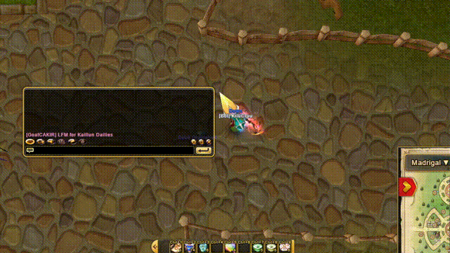

# Flyff Translate



> **2 versions disponibles :**
> - 🌐 **Extension Chrome** - Pour traduire dans le navigateur (Flyff Universe)
> - 🖥️ **Application Desktop** - Pour traduire partout sur votre PC (jeux, Discord, etc.)

---

# 🌐 Extension Chrome

<details open>
<summary>🇫🇷 Français</summary>

## Description

Extension Chrome pour traduire du texte dans Flyff Universe en appuyant sur **Alt gauche**.

## Installation

1. Ouvrez Chrome et allez sur `chrome://extensions/`
2. Activez le **Mode développeur** (en haut à droite)
3. Cliquez sur **Charger l'extension non empaquetée**
4. Sélectionnez le dossier `FlyffTranslateGoogle`
5. L'extension est prête !

## Utilisation

1. Allez sur [Flyff Universe](https://universe.flyff.com)
2. Cliquez dans un champ de texte (chat, etc.)
3. Tapez votre message en français
4. Appuyez sur **Alt gauche**
5. Le texte est automatiquement traduit en anglais !

**Note :** Vous pouvez aussi sélectionner une partie du texte pour ne traduire que cette sélection.

## Changer la langue

Par défaut, l'extension traduit du **Français (FR) vers l'Anglais (EN)**.

Pour changer les langues, modifiez le fichier `content.js` aux lignes 65-66 :

```javascript
sourceLang: 'FR',  // Langue source
targetLang: 'EN'   // Langue cible
```

Après modification, rechargez l'extension sur `chrome://extensions/`.

## Clé API DeepL

L'extension utilise une clé API DeepL gratuite par défaut. Si vous voulez utiliser votre propre clé :

1. Créez un compte gratuit sur [DeepL API](https://www.deepl.com/pro-api)
2. Modifiez `background.js` ligne 3 avec votre clé :
```javascript
const DEFAULT_API_KEY = 'votre-cle-api:fx';
```

</details>

---

<details>
<summary>🇬🇧 English</summary>

## Description

Chrome extension to translate text in Flyff Universe by pressing **Left Alt**.

## Installation

1. Open Chrome and go to `chrome://extensions/`
2. Enable **Developer mode** (top right)
3. Click **Load unpacked**
4. Select the `FlyffTranslateGoogle` folder
5. The extension is ready!

## Usage

1. Go to [Flyff Universe](https://universe.flyff.com)
2. Click in a text field (chat, etc.)
3. Type your message in French
4. Press **Left Alt**
5. The text is automatically translated to English!

**Note:** You can also select part of the text to translate only that selection.

## Change language

By default, the extension translates from **French (FR) to English (EN)**.

To change languages, edit the `content.js` file at lines 65-66:

```javascript
sourceLang: 'FR',  // Source language
targetLang: 'EN'   // Target language
```

After modification, reload the extension at `chrome://extensions/`.

## DeepL API Key

The extension uses a free DeepL API key by default. If you want to use your own key:

1. Create a free account on [DeepL API](https://www.deepl.com/pro-api)
2. Edit `background.js` line 3 with your key:
```javascript
const DEFAULT_API_KEY = 'your-api-key:fx';
```

</details>

---

<details>
<summary>🇩🇪 Deutsch</summary>

## Beschreibung

Chrome-Erweiterung zum Übersetzen von Text in Flyff Universe durch Drücken von **Linke Alt-Taste**.

## Installation

1. Öffnen Sie Chrome und gehen Sie zu `chrome://extensions/`
2. Aktivieren Sie den **Entwicklermodus** (oben rechts)
3. Klicken Sie auf **Entpackte Erweiterung laden**
4. Wählen Sie den Ordner `FlyffTranslateGoogle`
5. Die Erweiterung ist bereit!

## Verwendung

1. Gehen Sie zu [Flyff Universe](https://universe.flyff.com)
2. Klicken Sie in ein Textfeld (Chat, usw.)
3. Geben Sie Ihre Nachricht auf Französisch ein
4. Drücken Sie **Linke Alt-Taste**
5. Der Text wird automatisch ins Englische übersetzt!

**Hinweis:** Sie können auch einen Teil des Textes auswählen, um nur diese Auswahl zu übersetzen.

## Sprache ändern

Standardmäßig übersetzt die Erweiterung von **Französisch (FR) nach Englisch (EN)**.

Um die Sprachen zu ändern, bearbeiten Sie die Datei `content.js` in den Zeilen 65-66:

```javascript
sourceLang: 'FR',  // Quellsprache
targetLang: 'EN'   // Zielsprache
```

Nach der Änderung laden Sie die Erweiterung unter `chrome://extensions/` neu.

## DeepL API-Schlüssel

Die Erweiterung verwendet standardmäßig einen kostenlosen DeepL API-Schlüssel. Wenn Sie Ihren eigenen Schlüssel verwenden möchten:

1. Erstellen Sie ein kostenloses Konto bei [DeepL API](https://www.deepl.com/pro-api)
2. Bearbeiten Sie `background.js` Zeile 3 mit Ihrem Schlüssel:
```javascript
const DEFAULT_API_KEY = 'ihr-api-schluessel:fx';
```

</details>

---

# 🖥️ Application Desktop

Application de traduction **système-wide** - fonctionne partout sur votre PC !

<details open>
<summary>🇫🇷 Français</summary>

## Téléchargement

📥 **[Télécharger FlyffTranslate.exe](desktop-app/dist/FlyffTranslate.exe)**

## Utilisation

1. Lancez `FlyffTranslate.exe` (en tant qu'administrateur)
2. Écrivez du texte dans n'importe quelle application
3. Appuyez sur **Alt**
4. Le texte est traduit et remplacé automatiquement !

## Fonctionnalités

- ✅ Fonctionne partout : jeux, Discord, navigateurs, etc.
- ✅ Traduction ultra-rapide avec DeepL
- ✅ Raccourci simple : **Alt**
- ✅ Remplace automatiquement le texte original

## Configuration

Pour changer les langues, modifiez `translator.py` :
```python
SOURCE_LANG = "FR"  # Langue source
TARGET_LANG = "EN"  # Langue cible
```

## Compiler depuis le code source

```bash
cd desktop-app
pip install -r requirements.txt
pip install pyinstaller
pyinstaller --onefile --noconsole translator.py
```

</details>

<details>
<summary>🇬🇧 English</summary>

## Download

📥 **[Download FlyffTranslate.exe](desktop-app/dist/FlyffTranslate.exe)**

## Usage

1. Run `FlyffTranslate.exe` (as administrator)
2. Type text in any application
3. Press **Alt**
4. The text is translated and replaced automatically!

## Features

- ✅ Works everywhere: games, Discord, browsers, etc.
- ✅ Ultra-fast translation with DeepL
- ✅ Simple shortcut: **Alt**
- ✅ Automatically replaces original text

## Configuration

To change languages, edit `translator.py`:
```python
SOURCE_LANG = "FR"  # Source language
TARGET_LANG = "EN"  # Target language
```

## Build from source

```bash
cd desktop-app
pip install -r requirements.txt
pip install pyinstaller
pyinstaller --onefile --noconsole translator.py
```

</details>

---

## Language Codes (DeepL)

| Code | Language |
|------|----------|
| BG | Bulgarian |
| CS | Czech |
| DA | Danish |
| DE | German |
| EL | Greek |
| EN | English |
| ES | Spanish |
| ET | Estonian |
| FI | Finnish |
| FR | French |
| HU | Hungarian |
| ID | Indonesian |
| IT | Italian |
| JA | Japanese |
| KO | Korean |
| LT | Lithuanian |
| LV | Latvian |
| NB | Norwegian |
| NL | Dutch |
| PL | Polish |
| PT | Portuguese |
| RO | Romanian |
| RU | Russian |
| SK | Slovak |
| SL | Slovenian |
| SV | Swedish |
| TR | Turkish |
| UK | Ukrainian |
| ZH | Chinese |
